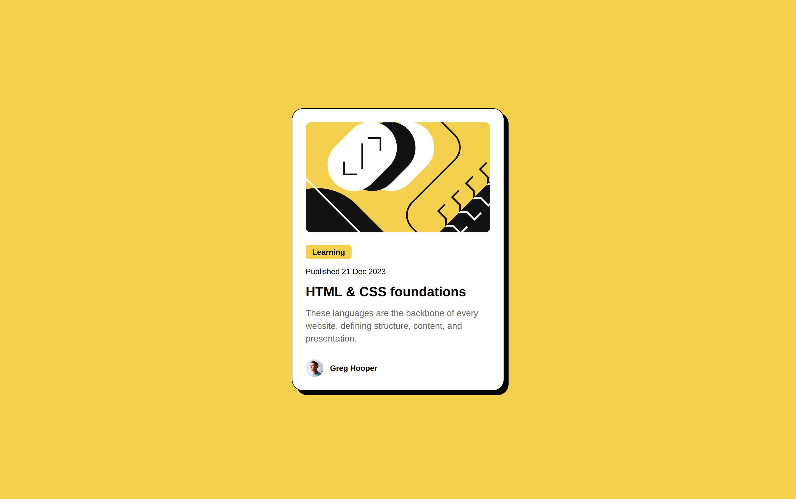
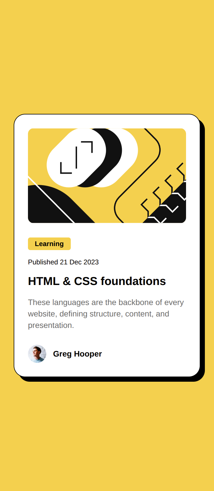

# Frontend Mentor - Blog preview card solution

This is a solution to the [Blog preview card challenge on Frontend Mentor](https://www.frontendmentor.io/challenges/blog-preview-card-ckPaj01IcS). Frontend Mentor challenges help you improve your coding skills by building realistic projects. 

## Table of contents

- [Overview](#overview)
  - [The challenge](#the-challenge)
  - [Screenshot](#screenshot)
  - [Links](#links)
- [My process](#my-process)
  - [Built with](#built-with)
  - [What I learned](#what-i-learned)
  - [Continued development](#continued-development)
  - [Useful resources](#useful-resources)
- [Author](#author)
- [Acknowledgments](#acknowledgments)

## Overview

### The challenge

Users should be able to:

- See hover and focus states for all interactive elements on the page

### Screenshot

Desktop

Mobile

### Links

- Solution URL: [Add solution URL here](https://your-solution-url.com)
- Live Site URL: [Add live site URL here](https://your-live-site-url.com)

## My process

### Built with

- Tailwindcss
- Flexbox
- Mobile-first workflow
- [Tailwindcss](https://tailwindcss.com/) - Tailwindcss a utility-first CSS framework
- [Parcel](https://parceljs.org/) - The zero configuration build tool

### What I learned

I've learned, basically, about the Parcel build tool and git merge solving merge conflicts.

### Continued development

I want to keep go on learning about build tools, frameworks like React/Vue/Angular.

### Useful resources

Nothing at while.

## Author

- Frontend Mentor - [@Clar-Junior](https://www.frontendmentor.io/profile/Clar-Junior)
- Github - [@Clar-Junior](https://github.com/Clar-Junior)

## Acknowledgments

Nothing at while.
